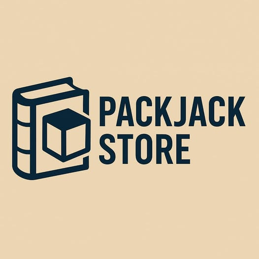

# 📚 Packjack Store — باكدجك ستور

<div align="center">

<!-- Project Banner Suggestion -->


[](https://react.dev/)
[](https://vitejs.org/)
[](https://www.typescriptlang.org/)
[](https://tailwindcss.com/)
[](https://github.com/pmndrs/zustand)
[](https://tanstack.com/query/latest)
[](LICENSE)

<p align="center">
  <strong>أفضل منصة عربية ذكية لشراء الكتب الإلكترونية والورقية وباقات المناهج المدرسية لجميع المراحل الدراسية بطريقة سلسة، آمنة ومبتكرة.</strong>
</p>

[✨ تصفح الموقع الإلكتروني](https://packadgek.com/)

---

</div>

## 📌 1. Project Title
**Packjack Store (بكدجك ستور)** — A highly animated, high-performance educational e-commerce platform specializing in textbooks, learning guides, and comprehensive subject packages tailored for Middle Eastern/Arabic school curricula.

---

## 📖 2. Short Description
**Packjack Store** is a state-of-the-art Web Application designed specifically to simplify access to educational materials. Built with **React 18**, **TypeScript**, and **Vite**, and styled using a premium "Glass-Neon" dark/light mode aesthetic via **Tailwind CSS** and **Radix UI (shadcn/ui)**, it offers smooth layouts driven by **Framer Motion** and an interactive, modern **Three.js** particle background. The system is engineered to manage thousands of students and packages, syncing carts to the local state, using custom JWT auth, and featuring a comprehensive administrative control panel for schools, categories, subjects, and delivery fees.

---

## 🔗 3. Demo / Preview
Experience the production release of Packjack Store online:
*   **Live Web App**: [https://packadgek.com/](https://packadgek.com/)
*   **API Server Endpoint**: `https://api.packadgek.com`
*   **Admin Dashboard**: [https://packadgek.com/admin](https://packadgek.com/admin)

> [!NOTE]
> If you are setting up a local or staging environment, ensure your API keys and endpoints match your development backend configuration in the `.env` settings.

---

## 📸 4. Screenshots Section

<div align="center">
  <table style="width: 100%; text-align: center; border-collapse: collapse;">
    <tr>
      <td style="width: 50%; padding: 10px;">
        <strong>🖥️ Interactive Home Page (Three.js Particles)</strong>
        <br />
        
        <br />
        <em>Placeholder: Update with Home Screen preview</em>
      </td>
      <td style="width: 50%; padding: 10px;">
        <strong>🎨 Interactive Book Search & Grades Filter</strong>
        <br />
        
        <br />
        <em>Placeholder: Update with Book Catalogue preview</em>
      </td>
    </tr>
    <tr>
      <td style="width: 50%; padding: 10px;">
        <strong>🛡️ Premium Admin Control Center</strong>
        <br />
        
        <br />
        <em>Placeholder: Update with Admin Analytics panel</em>
      </td>
      <td style="width: 50%; padding: 10px;">
        <strong>🛒 Interactive Cart & Neon Checkout Page</strong>
        <br />
        
        <br />
        <em>Placeholder: Update with Shopping Cart screen</em>
      </td>
    </tr>
  </table>
</div>

---

## ⚡ 5. Features

### 👤 Student & User Experience:
*   **Interactive 3D Particles Atmosphere**: Home page leverages custom Three.js canvas to render responsive, mouse-interactive cybernetic background clouds.
*   **Dual Aesthetic System**: Premium Light/Dark mode switcher powered by Zustand and standard Tailwind tokens, saved directly to LocalStorage.
*   **Fluid Framer Motion Transitions**: Seamless page entries, layout adjustments, and smooth custom mobile slide-out menus.
*   **Advanced Educational Filters**: Filter study packages and textbooks by Grade (الصف الأول/الثاني/الثالث الثانوي), Category, Subject, and specific Teacher.
*   **Robust Session Protection**: Protected routes (`/cart`, `/checkout`, `/dashboard`) verifying user token presence before allowing access.
*   **Persistent Shopping Cart**: Highly reactive cart system powered by Zustand that synchronizes seamlessly with local storage and performs silent backend API sync checks.

### 🔑 Powerful Admin Dashboard (`/admin`):
*   **Multi-tenant Stats Panel**: High-level grid displaying current users, order rates, package inventory, and real-time revenue stats.
*   **Books Management (CRUD)**: Easily add, edit, or delete book packages, upload cover images, flag out-of-stock items, and handle discount tags (`price_before_discount`).
*   **Order Tracking**: View pending orders, search invoices by student ID, and update dispatch/delivery statuses.
*   **Subject & Teacher Management**: Map books to individual school subjects and academic teachers for intuitive student browsing.
*   **Flexible Delivery Fees**: Manage delivery pricing dynamically depending on student governorates/addresses.

---

## 🛠️ 6. Tech Stack
The project is built on top of a cutting-edge frontend ecosystem:

*   **Core**: [React 18](https://react.dev/) + [TypeScript](https://www.typescriptlang.org/) + [Vite](https://vitejs.org/)
*   **Styling**: [Tailwind CSS v3](https://tailwindcss.com/) + [Radix UI](https://www.radix-ui.com/) (shadcn/ui primitives)
*   **State Management**: [Zustand v5](https://github.com/pmndrs/zustand)
*   **Data Fetching**: [TanStack React Query v5](https://tanstack.com/query/latest)
*   **Animations & Graphics**: [Framer Motion](https://www.framer.com/motion/) + [Three.js (WebGL)](https://threejs.org/) + [Lucide Icons](https://lucide.dev/)
*   **Validation & Forms**: [React Hook Form](https://react-hook-form.com/) + [Zod Schema Validation](https://zod.dev/)

---

## 💾 7. Installation

Set up the project in your local development environment using Bun, NPM, or Yarn.

### Prerequisites:
Make sure you have Node.js (v18+) or Bun (v1.0+) installed.

### Step-by-Step Guide:

1.  **Clone the Repository**:
    ```bash
    git clone https://github.com/your-username/packagek-store-ecommerce.git
    cd packagek-store-ecommerce
    ```

2.  **Install Project Dependencies**:
    *   **Using Bun (Recommended)**:
        ```bash
        bun install
        ```
    *   **Using NPM**:
        ```bash
        npm install
        ```
    *   **Using Yarn**:
        ```bash
        yarn install
        ```

---

## 🔑 8. Environment Variables
To connect the application to the production or staging backend API, configure your `.env` file at the root of `packagek-store/`:

Create a `.env` file:
```bash
touch .env
```

Add the following environment variable:
```env
VITE_BASE_API=https://api.packadgek.com
```

> [!WARNING]
> Do not commit your `.env` file to Github or source control. It contains environment-specific URLs and secrets. Ensure it is included in your `.gitignore`.

---

## 🚀 9. Running the Project

Start the local server or build the application for production using the following commands:

| Command | Bun (Recommended) | NPM Equivalent | Description |
| :--- | :--- | :--- | :--- |
| **Development Server** | `bun run dev` | `npm run dev` | Starts Vite local hot-reloaded development server. |
| **Production Build** | `bun run build` | `npm run build` | Compiles the production bundle into `dist/`. |
| **Lint Check** | `bun run lint` | `npm run lint` | Runs ESLint rules checking code health. |
| **Preview Production** | `bun run preview` | `npm run preview` | Runs the compiled build locally for verification. |

---

## 📂 10. Folder Structure
Below is a structured overview of the `packagek-store` codebase:

```ascii
packagek_store/
├── packagek-store/              # Main frontend workspace
│   ├── public/                  # Public assets (icons, images)
│   ├── src/
│   │   ├── components/          # Reusable React components
│   │   │   ├── admin/           # Admin layout, sidebar, metrics
│   │   │   ├── ui/              # Radix UI / Shadcn base components
│   │   │   ├── Navbar.tsx       # Scrolling main navigation & RTL menu
│   │   │   ├── Footer.tsx       # Standard Arabic footer
│   │   │   ├── BookCard.tsx     # Animated card displaying items & discounts
│   │   │   └── ProtectedRoute.tsx # Route barrier based on JWT
│   │   ├── context/
│   │   │   └── AuthContext.tsx  # Auth state, login/logout & JWT renew loop
│   │   ├── hooks/               # Custom reusable React hooks
│   │   ├── lib/
│   │   │   └── utils.ts         # TwMerge and Clsx class utilities
│   │   ├── pages/               # Page Components (lazy-loaded in App.tsx)
│   │   │   ├── auth/            # Login and Registration pages
│   │   │   ├── home/            # Home, Books, Checkout, Cart, FAQ
│   │   │   └── admin/           # Admin dashboards and CRM managers
│   │   ├── store/
│   │   │   └── useStore.ts      # Zustand theme controller & cart state
│   │   ├── App.css              # Custom neon gradients and typography
│   │   ├── index.css            # Base Tailwind imports and font-faces
│   │   ├── App.tsx              # React-Router routes & lazy boundaries
│   │   └── main.tsx             # Entry point
│   ├── .env                     # Local environment keys (ignored)
│   ├── tailwind.config.ts       # Tailwind CSS dynamic neon extensions
│   ├── vite.config.ts           # Vite configurations & compiler aliases
│   └── package.json             # Core dependency manifest
└── .gitignore                   # Master workspace git ignore rules
```

---

## 🌐 11. API Endpoints (Integration Map)
The frontend communicates directly with a PHP REST API hosted on `${VITE_BASE_API}` using traditional form variables or query string parameters.

| Endpoint | Method | Params | Description |
| :--- | :--- | :--- | :--- |
| `/user/books/getBooks` | `GET` | *None* | Fetches list of books, subjects, grades, and discounts. |
| `/user/cart/getCart` | `GET` | `user_token` | Retrieves items currently saved in the student's cloud cart. |
| `/user/account/updateUserToken` | `POST` | `refresh_token` (FormData) | Auto-refreshes expired access tokens. |
| `/user/orders/submitOrder` | `POST` | `cart`, `address`, `token` | Dispatches checking data and submits student orders. |

---

## 🔒 12. Authentication Flow

The platform implements an automated token management flow to keep student sessions alive seamlessly:

```mermaid
sequenceDiagram
    autonumber
    actor Student as Student Client
    participant API as Backend REST API
    
    Note over Student: Checks saved JWT in LocalStorage
    Student->>API: Fetches books or cart using saved user_token
    
    rect rgb(40, 44, 52)
        Note over Student: Auto-renew loop active every 30 seconds
        Student->>Student: Checks token_expiry against Date.now()
        opt token_expiry is close to expiring (<= 60s)
            Student->>API: POST /updateUserToken (FormData with refresh_token)
            API-->>Student: Returns new_token, new_refresh_token, & expiry
            Student->>Student: Saves new credentials in LocalStorage
            Note over Student: Toast notification shows "Session Renewed Successfully"
        end
    end
```



---

## 🚀 13. Deployment
The repository is optimized for instant deployment using **Vercel** or any standard static server:

### Deploying to Vercel:
1.  Import your GitHub repository into the **Vercel Dashboard**.
2.  Set the **Root Directory** to `packagek-store`.
3.  Configure **Build Settings**:
    *   **Build Command**: `npm run build` or `bun run build`
    *   **Output Directory**: `dist`
4.  Add your **Environment Variables**:
    *   `VITE_BASE_API` = `https://api.packadgek.com`
5.  Click **Deploy**!

---

## 🔮 14. Future Improvements
*   **3D Interactive Book Mockups**: Integrate `@react-three/fiber` components to render high-quality interactive 3D books previews on details page.
*   **Live Order Tracking & SMS Notifications**: Connect twilio or WhatsApp API notifications to alert students of delivery stages.
*   **E-Book PDF Viewer with Watermarking**: Provide highly secure, in-browser PDF reader tool to restrict print/share capabilities.
*   **Teacher Streaming/Lecture Integration**: Direct video integration with YouTube or Vimeo keys.

---

## 🤝 15. Contributing
Contributions are extremely welcome! Follow these steps:
1.  Fork the Project.
2.  Create your Feature Branch (`git checkout -b feature/AmazingFeature`).
3.  Commit your Changes (`git commit -m 'Add some AmazingFeature'`).
4.  Push to the Branch (`git push origin feature/AmazingFeature`).
5.  Open a **Pull Request**.

---

## 📄 16. License
Distributed under the **MIT License**. See `LICENSE` for more information.

---

## ✉️ 17. Contact Information
*   **Company Name**: Packjack Store
*   **Website**: [https://packadgek.com/](https://packadgek.com/)
*   **Facebook Page**: [Packjack on Facebook](https://www.facebook.com/share/17LEey2RzW/?mibextid=wwXIfr)
*   **Project Lead Email**: `support@packadgek.com` (Placeholder)
"# packagek-store-ecommerce" 
